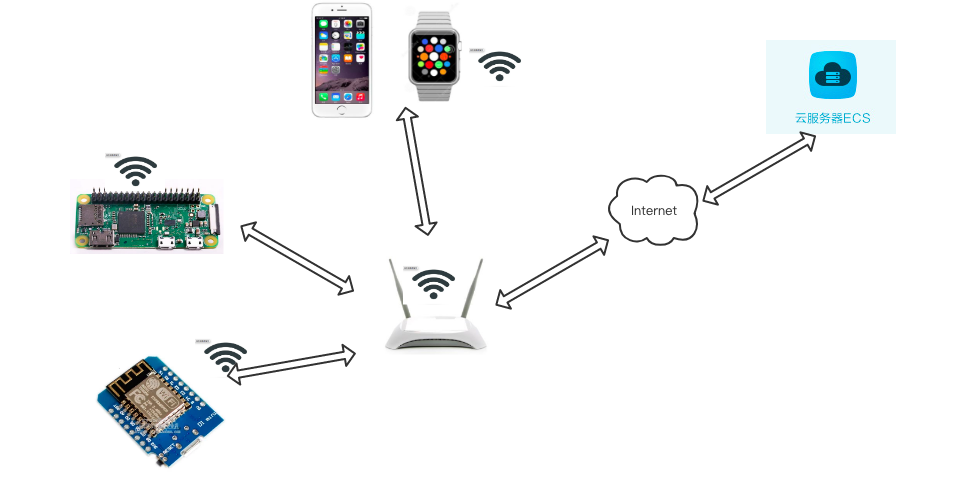
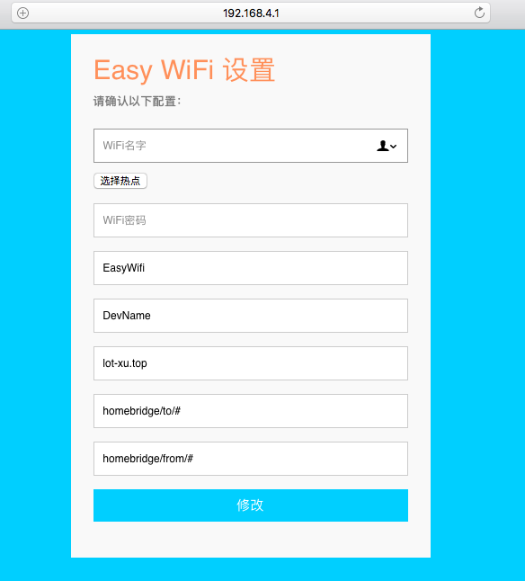
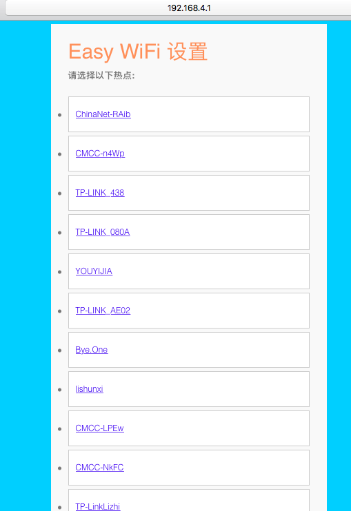
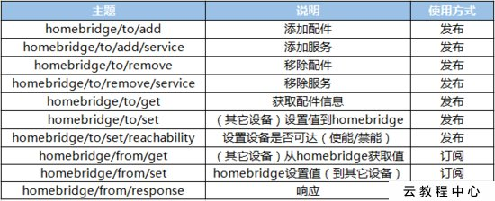
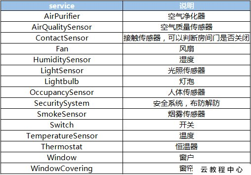
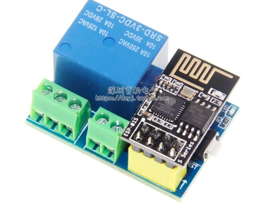
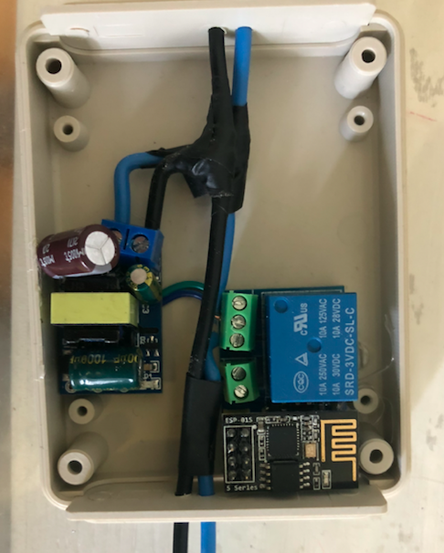
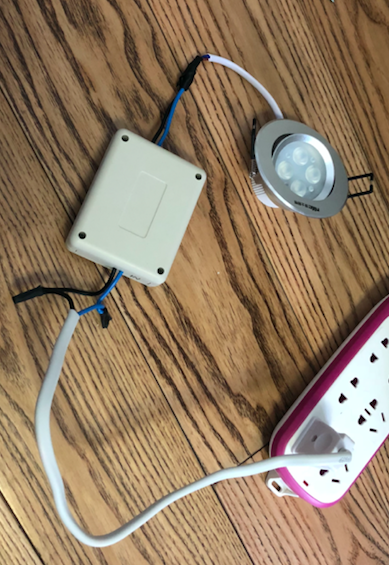
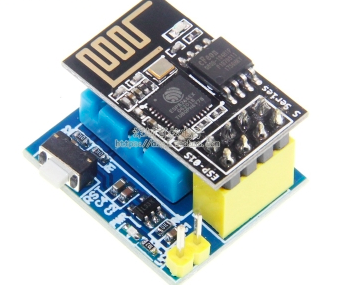

## Summary

没有找到合适的简单解决方案，将Esp8266控制的设备连接到HomeKit.
所以参照EspEasy实现 HomeKit和Esp8266连接。

### 连接方式：



##### Raspberry Zero

Raspberry 安装homebridge-mqtt：
[https://www.npmjs.com/package/homebridge-mqtt](https://www.npmjs.com/package/homebridge-mqtt)

##### 阿里云服务器

云服务器上跑以下Docker
[https://store.docker.com/images/eclipse-mosquitto](https://store.docker.com/images/eclipse-mosquitto)

##### Esp8266

Esp8266上使用Arduino烧写本项目的EasyWifi.

### 测试的设备：

+ [NodeMcu](https://item.taobao.com/item.htm?spm=a1z09.2.0.0.70762e8dRulKV9&id=533795236140&_u=911aik5dcf48) 
+ [ESP-01S](https://item.taobao.com/item.htm?spm=a1z09.2.0.0.70762e8dRulKV9&id=560359232453&_u=911aik5d6366)  
+ [mini D1 wifi](https://item.taobao.com/item.htm?spm=a1z10.3-c-s.w4002-14787471870.9.6cd06865Y9ewEe&id=533672579285) 


## Features

* 可通过浏览器访问192.168.4.1,配置以下信息
 + 设备名称
 + MQTT服务器
 + 需要连接的ssid和密码
 + 发布和订阅的主题
 + 设备连接后，自动添加到HomeBridge




## Quickstart

### 树莓派安装homebridge

**~/.homebridge/config.json**

```
{
    "bridge": {
    "name": "Homebridge",
    "username": "B8:E8:56:17:E3:58",
    "port": 51825,
    "pin": "123-11-122"
    },
    
    "description": "This is an example configuration file with pilight plugin.",

    
  "platforms": [
    {
    "platform": "mqtt",
  	"name": “homebridge”,
  	"url": "mqtt://lot-xu.top",
  	"port": "1883",
  	"topic_type": "multiple",
  	"topic_prefix": "homebridge",
  	"username": "",
  	"password": "",
  	"qos": 1
    }]
}

```



### 8266控制开关

[ESP-01S 模块 继电器
](https://item.taobao.com/item.htm?spm=a230r.1.14.22.598026eekDEPEF&id=570953942453&ns=1&abbucket=9#detail)



[精密5V700mA](https://item.taobao.com/item.htm?spm=a1z09.2.0.0.16e32e8doaJbNj&id=544195300484&_u=f11aik5dbae1)


**把这些放在一个盒子中：**



**盖上盖子，接上射灯和插头**




### 8266通过DHT11 获取温度和湿度

[ESP-01S DHT11 温湿度](https://item.taobao.com/item.htm?spm=a1z09.2.0.0.16e32e8doaJbNj&id=564986974149&_u=f11aik5dc60d)



### 红外控制空调


向HomeBridge发送追加传感器的消息
```
{"name":"GreeAc","service_name":"IRRemoteAC","service":"Thermostat"}
```

收到HomeBridge设置变更的消息
```
{"name":"GreeAc","service_name":"IRRemoteAC","characteristic":"TargetHeatingCoolingState","value":1}
```
***

需要有两个文件，一个存Accessory的List，另外一个存IR数据库。

Accessory文件格式

```
[{"name":"GreeAc","service_name":"IRRemoteAC","service":"Thermostat"},
{"name":"SansungAC","service_name":"IRRemoteAC","service":"Thermostat”}],

[{"name":"TVBox","service_name":"IRRemoteAC","service":"Thermostat"},

```

数据库文件格式
```
[{“name”:”TVBox”,”feature”:”power_on_off”,”type”:”NEC”,”code”:”80BF3BC4”,”len”:32},
{“name”:”TVBox”,”feature”:”power_on”,”type”:”NEC”,”code”:”80BF3BC4”,”len”:32}
]

```

